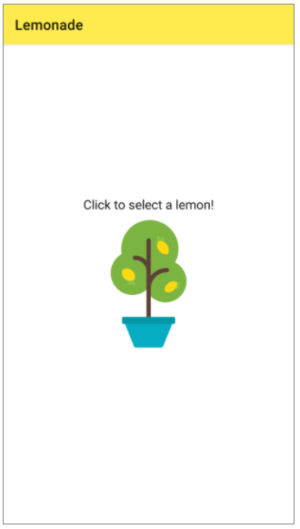
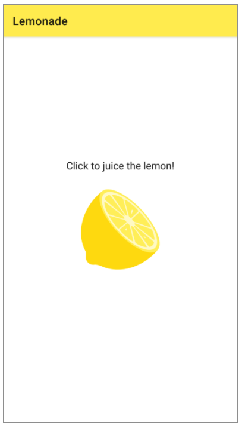

Project: Lemonade App - CodeLab
==================================

A simple, interactive mobile app that allows you to juice lemons until you have a glass of lemonade.

Tapping the lemon tree presents the user with a lemon that they can tap to "squeeze" for an unspecified number of times (the exact number of required squeezes is randomly generated) before moving to the next screen.

Once the user has tapped to squeeze the lemon the correct number of times, they will see an image of a glass to "drink" the lemonade.

After clicking to drink the lemonade, the glass appears empty, and the user can tap the image again to return to the first screen, and select another lemon from the tree.

